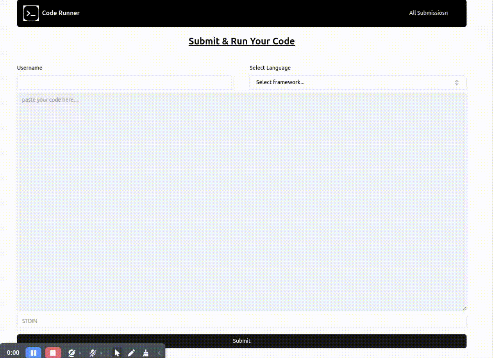
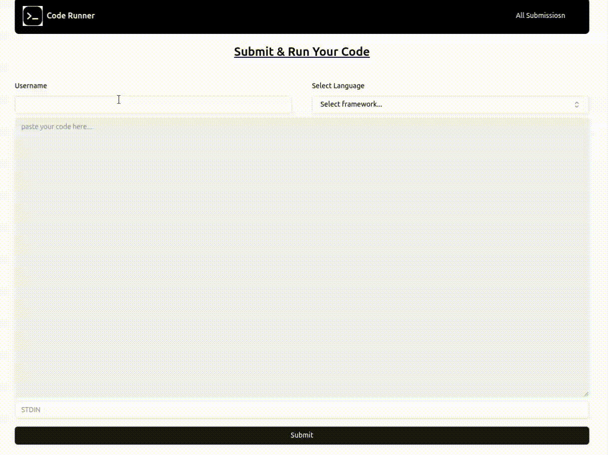

### CodeRunner
CodeRunner is a web application that allows users to submit code snippets and run them on different languages. It provides a user-friendly interface for interacting with the code submission system.

### Features
- User can submit code snippets in different languages
- User can view their submissions
- User can delete their submissions
- User can view the status of their submissions

### Demo Video

Without stdin:


With stdin:

### How to run

1. Open 2 terminals

```bash
cd CodeRunner
```
2. Install dependencies

```bash
cd client && npm install
```

```bash
cd server && npm install
```

2. Run the both client and server side using.

```bash
npm run dev
```

[NOTE: make sure you've mysql database running with already created table (submission) follow below steps]
3. Create a table in mysql database

```sql
mysql -u root -p; // there will pompt enter password
create database test;
use test;
create table submission (submissionId int auto_increment primary key, username varchar(255), language varchar(255), code text, stdin text, status varchar(255), result text);
exit;
```
